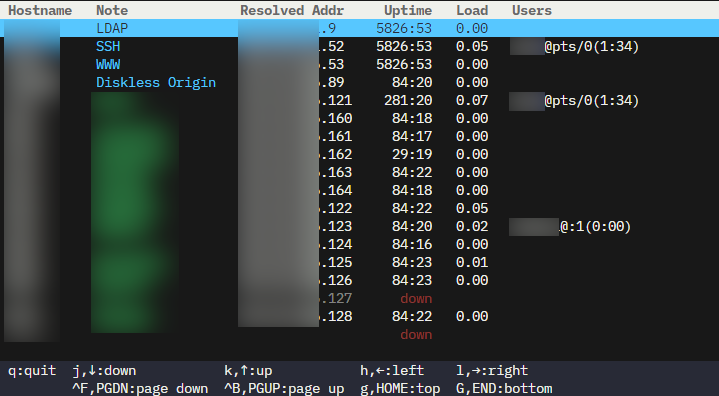

# trwho
A TUI application to show rwhod information saved as  `/var/spool/rwho/whod.*`.



## Install
```
$ go install github.com/hrko/trwho@latest
```

## Usage
First, make sure that you can read `/var/spool/rwho/`.
```
$ sudo chmod 755 /var/spool/rwho
```

Then, just run `trwho`.
```
$ trwho
```

## Config
Make `config.json` at `~/.config/trwho/` or `/etc/trwho/`. If the user config exists, the global config will not be loaded.

The color of a note text can be customized using a [color tag](https://pkg.go.dev/github.com/rivo/tview#hdr-Colors).

Here is an example of `config.json`:
```json
{
  "hosts": [
    {
      "hostname": "swww01",
      "note": "WWW Server"
    },
    {
      "hostname": "slda01",
      "note": "[blue]LDAP Server"
    }
  ]
}
```
